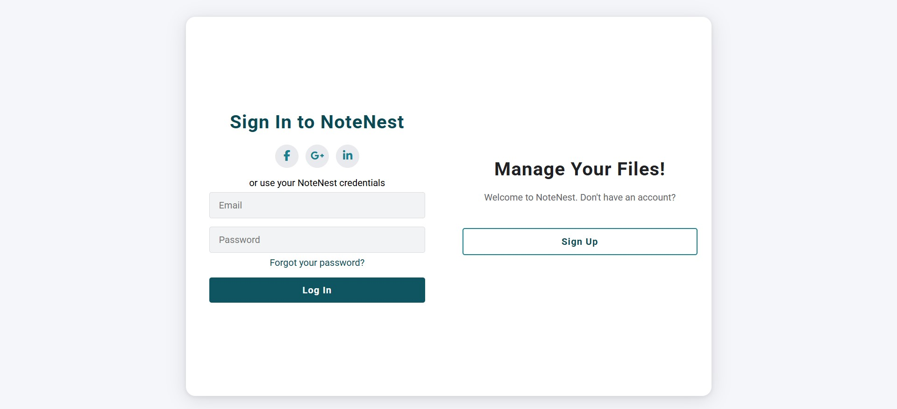
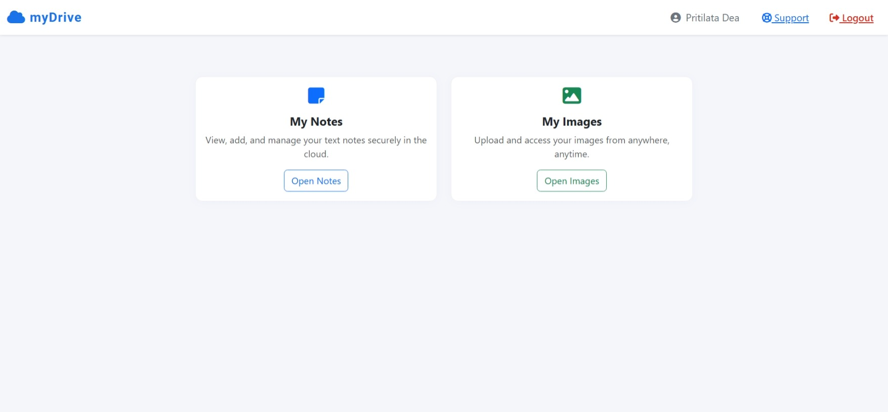
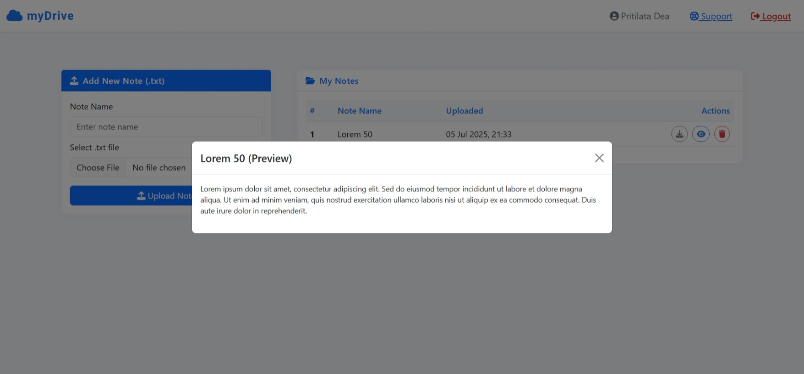
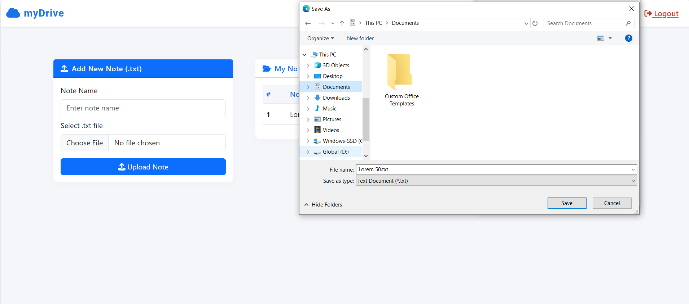
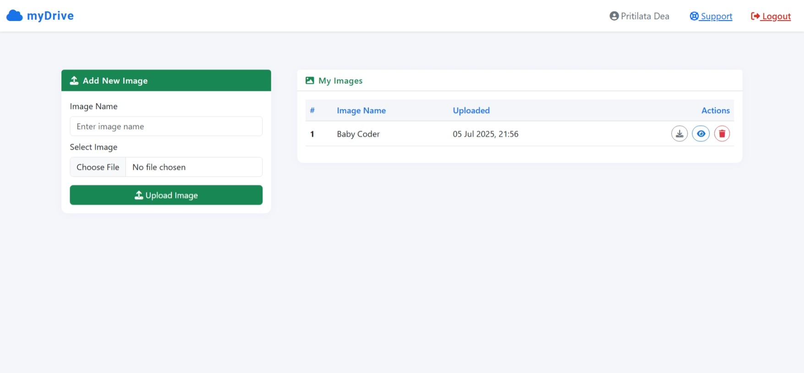
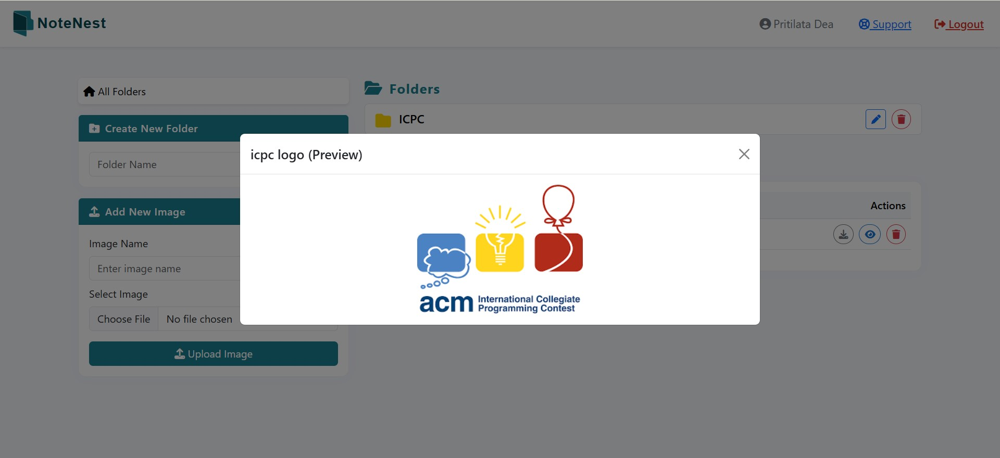
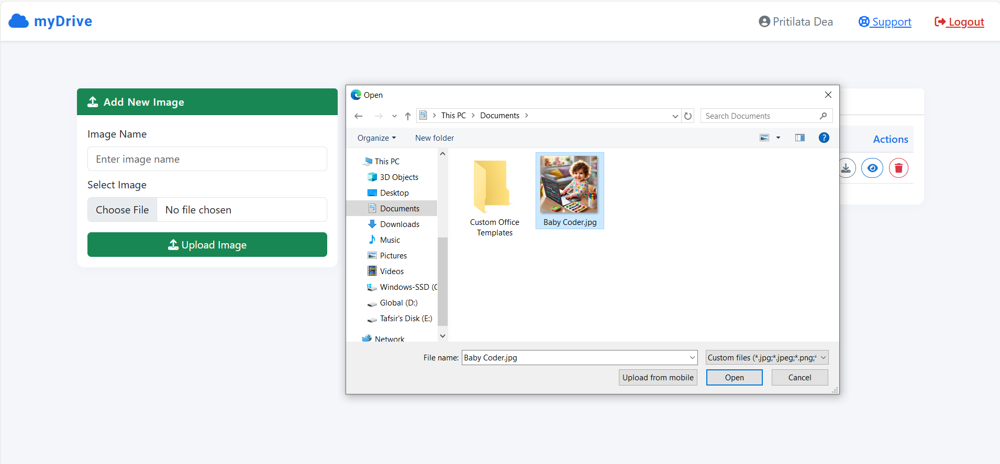

# myDrive

myDrive is a secure and user-friendly personal cloud drive web application, inspired by Google Drive. It allows users to upload, preview, download, and organize TXT notes and image files—all with a polished, responsive interface.

---

## Features

- **User Authentication:** Secure registration and login required.
- **Dashboard:** Modern, easy-to-use main page with navigation.
- **Notes Management:** Upload, list, preview (modal), download, and delete `.txt` note files.
- **Images Management:** Upload, list, preview (modal), download, and delete `.jpg`, `.jpeg`, `.png`, `.gif` images.
- **Responsive UI:** Built with [Bootstrap 5](https://getbootstrap.com/) and custom CSS for a Google Drive–like look.
- **Security:** Strict user isolation—users can only access their own files.
- **Favicon:** Custom cloud/favicon for a branded feel.

---

## Tech Stack

- **Backend:** PHP (7.4+ recommended)
- **Frontend:** HTML, Bootstrap 5, Font Awesome
- **Database:** MySQL
- **File Storage:** Files saved to local `/uploads/notes/` and `/uploads/images/`

---

## Screenshots

### 1. Register Page

New users can sign up using the registration form.


### 2. Login Page

Registered users can log in to access the application.



### 3. Dashboard

After logging in, users are directed to the main dashboard.



### 4. My Notes Section

Users can view their uploaded notes in this section.


### 5. Note Preview Modal

Users can preview any note before downloading or editing.



### 6. Download Note Dialog

Users can download their notes from the system.



### 7. My Images Section

This section displays all images uploaded by the user.



### 8. Image Preview Modal

Clicking on any image opens a detailed preview.



### 9. Upload Image Dialog

Users can upload new images to their account.



---

## Installation & Setup

1. **Clone the Repository**
    ```bash
    git clone https://github.com/tafsiruzzaman/mydrive.git
    cd mydrive
    ```

2. **Create Database and Tables**
    - Create a new MySQL database, e.g., `my_drive`.
    - Use the following tables:
      ```sql
      CREATE TABLE users (
          id INT PRIMARY KEY AUTO_INCREMENT,
          name VARCHAR(100) NOT NULL,
          email VARCHAR(255) NOT NULL UNIQUE,
          password VARCHAR(255) NOT NULL
      );

      CREATE TABLE notes (
          id INT PRIMARY KEY AUTO_INCREMENT,
          user_id INT NOT NULL,
          file_name VARCHAR(255) NOT NULL,
          stored_file VARCHAR(255) NOT NULL,
          uploaded_at DATETIME DEFAULT CURRENT_TIMESTAMP,
          FOREIGN KEY (user_id) REFERENCES users(id)
      );

      CREATE TABLE images (
          id INT PRIMARY KEY AUTO_INCREMENT,
          user_id INT NOT NULL,
          file_name VARCHAR(255) NOT NULL,
          stored_file VARCHAR(255) NOT NULL,
          uploaded_at DATETIME DEFAULT CURRENT_TIMESTAMP,
          FOREIGN KEY (user_id) REFERENCES users(id)
      );
      ```

3. **Configure the Application**
    - Update database credentials in `config.php`.
    - Make sure directories `/uploads/notes/` and `/uploads/images/` exist and are writable by your web server.
    - Place project folder in your web server's root (e.g., `htdocs/mydrive/` for XAMPP).

4. **Access and Test**
    - Open your browser and navigate to `http://localhost/mydrive`.

---

## Project Structure

```
/
├── config.php              
├── db.php                  
├── register.php            
├── login.php               
├── dashboard.php           
├── my_notes.php            
├── my_images.php           
├── note_download.php       
├── note_preview.php        
├── image_download.php      
├── image_preview.php       
├── uploads/
│   ├── notes/              
│   └── images/             
├── css/
│   └── dashboard.css       
├── screenshots/            
└── ...
```

---

## Contributors

- [@tafsiruzzaman](https://github.com/tafsiruzzaman)
- [@pritilatadea](https://github.com/pritilatadea)

---

## Security Highlights

- **User Data Isolation:** Users can only interact with their uploads.
- **Input Validation:** Strict filetype and size checks.
- **Sanitization:** File and form inputs sanitized.
- **Password Security:** Passwords are hashed in the DB.
- **SQL Injection Protection:** All queries use prepared statements.

---

## Potential Enhancements

- Multi-file upload
- User profile and password change
- File/folder organization
- File/folder sharing
- Advanced search/filter
- Drag and drop upload
- Dark/light mode

---

## License

MIT License. © [@tafsiruzzaman](https://github.com/tafsiruzzaman), [@pritilatadea](https://github.com/pritilatadea)

---
